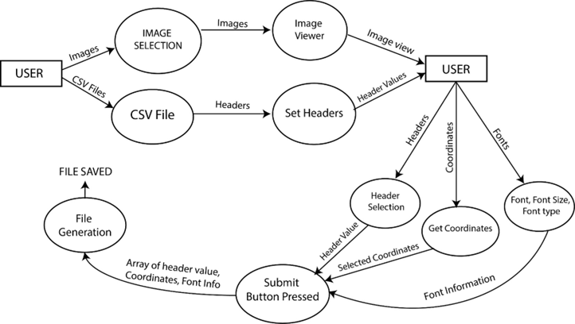

# Elite_Project
ELITE is an Fellowship program which runs various innovative projects in our college every summer vacations. I have participated in the program and chosen a project. My project is to create a open source software which will help users in generating a large number of certificates by giving image design and csv file as the input.

# Software for Editing Multiple Image Document

## Acharya Narendra Dev College
Under ELITE Scholarship Program  
[10th June 2019 – 31st July 2019]

Submitted by:  
Prince Sharma (Dept. of Electronics)  
Ankit Negi (Dept. of Electronics)

Guidance:  
Ms. Vandita Grover (Dept. of Computer Science)

## Acknowledgment
We would like to express our gratitude to Ms. Vandita Grover for her invaluable contribution and generous suggestions towards the completion of this project. We feel honored and privileged to work under her guidance.
We are thankful to our principal, Dr. Ravi Toteja, for running the ELITE scholarship program during 5th June – 31st July that helps students to learn new things beyond the scope of the curriculum.

Prince Sharma  
Ankit Negi

## Contents
1. [Introduction](#introduction)
2. [Tools and Technology Used in Building the Project](#tools-and-technology-used-in-building-the-project)
3. [Design of the Software](#design-of-the-software)
4. [GUI Design of the Software](#gui-design-of-the-software)
5. [Back End Processing](#back-end-processing)
6. [Coding](#coding)
7. [Future Scope](#future-scope)
8. [User Manual](#user-manual)
9. [References](#references)

## Introduction
The use of computers has made cumbersome, repetitive, and time-consuming tasks a lot easier, efficient, and productive. This project aims to automate customized documents by generating bulk certificates customized with the awardee information on each certificate.

### Overview
The software has the potential to fulfill the requirement of image editing at a large scale by using simple image editing algorithms to add unique pieces of information. It also provides an opportunity for potential developers to add extra features that support a wide range of formatting within the image.

### Objective
The goal of this project was to create a free GUI-based software to automate the task of mass production of certificates (or Image document) based on input data in CSV format. It eliminates the tedious task of manually writing on each certificate by automating the task of writing on the image.

## Tools and Technology Used in Building the Project
### Tools and Technology used
- Java: Java is a general-purpose programming language used for developing various applications.
- JavaFX: JavaFX is an open-source platform for creating desktop and mobile applications.
- FXML: FXML is an XML-based user interface markup language used for defining the user interface of a JavaFX application.
- Eclipse: Eclipse is an integrated development environment (IDE) used for Java programming.
- Scene builder: JavaFX Scene Builder is a visual layout tool for designing JavaFX application user interfaces.

### Minimum Hardware and Software Requirement
The software requires a minimum of 2 GB RAM and a compatible Windows or Linux operating system. At least Intel 4004 Microprocessor should be present for smooth running of the application.

## Design of the Software
This chapter describes the design and implementation of the software, highlighting the important components and functionality.

### Design Constraints
Size of the image viewer is fixed. Whenever an image is imported, it initially displays half of the image to avoid null viewport condition. Pan and zoomable effects are added to allow precise viewing and clicking on a certain point.

### System Design
The software's functioning is explained using a Level 1 Data Flow Diagram (DFD). The DFD represents the flow of data and provides information about the inputs, outputs, and processes involved.

#### Level 1 DFD

### Component Design and Module Description
### Component Design and Module Description
The software is divided into several components and modules to ensure modularity and maintainability. Here are the main components and their descriptions:

- **Main Application**: This is the main entry point of the software. It initializes the GUI, handles user interactions, and coordinates the functioning of other modules.

- **Image Viewer**: This module is responsible for displaying the image document and providing functionalities like pan and zoom for precise viewing.

- **Data Importer**: This module handles the import of data in CSV format. It reads the data and processes it for further use in generating customized certificates.

- **Text Overlay**: This module overlays the customized text onto the image document. It takes the imported data and positions the text at the specified locations on the image.

- **Image Exporter**: This module handles the exporting of the generated customized certificates. It saves the final output images in the desired format and location.

- **Error Handler**: This module handles errors and exceptions that may occur during the execution of the software. It provides appropriate error messages and suggestions for troubleshooting.

- **Settings Manager**: This module manages the software settings and configurations. It allows the user to customize various aspects of the software, such as font style, color, and positioning of the text overlay.

### GUI Design of the Software
The graphical user interface (GUI) of the software is designed using JavaFX and FXML. It provides an intuitive and user-friendly interface for interacting with the software. The GUI consists of the following main components:

- **Menu Bar**: It provides access to various functionalities and settings of the software.

- **Image Viewer**: This area displays the imported image document and allows the user to zoom in, zoom out, and pan the view.

- **Data Import Panel**: It provides options to import the data in CSV format and preview the imported data.

- **Text Overlay Panel**: This panel allows the user to customize the text overlay settings, such as font style, size, color, and position.

- **Export Panel**: It provides options to export the generated customized certificates in the desired format and location.

### Back End Processing
The back end processing of the software involves various algorithms and techniques to handle the import, customization, and export of the image document. Here are the main steps involved:

1. Import the data from the CSV file and validate it for correctness and completeness.
2. Load the image document and display it in the image viewer.
3. Extract the required information from the imported data and position it on the image document.
4. Overlay the text on the image document based on the specified positions and formatting.
5. Generate the customized certificates and display them in the image viewer.
6. Provide options to export the generated certificates in different formats, such as PNG, JPEG, etc.

### Coding
The software is implemented using Java programming language and JavaFX framework. The coding follows object-oriented principles and modular design. It utilizes various libraries and APIs for handling image processing, file operations, and user interface interactions.

The code is structured into different classes and packages, each responsible for specific functionalities. The classes are organized based on their relationships and dependencies. Proper comments and documentation are provided to enhance code readability and maintainability.

### Future Scope
The software can be further enhanced and extended with the following features:

- Support for more image editing functionalities, such as image cropping, rotation, and filters.
- Integration with external databases or APIs to fetch real-time data for customization.
- Batch processing capabilities to handle large sets of data and generate certificates in bulk.
- Support for additional image formats and export options.
- Localization and multi-language support for catering to a wider user base.

### User Manual
- Install latest version vs code or update it if you have it already.
- Install java extension pack.
- Follow the steps [here](https://www.youtube.com/watch?v=H67COH9F718) during this step enable set java_home variable that way you wont have to add it manually
- go till last where he creates a single program. Replace that single program using the code given in src file we have.
- Download [commons-csv-1.8-bin.zip](https://commons.apache.org/proper/commons-csv/download_csv.cgi)
- Extract the file and add 2 new jars commons-csv-1.8-sources and commons-csv-1.8 to the project and run the main.
